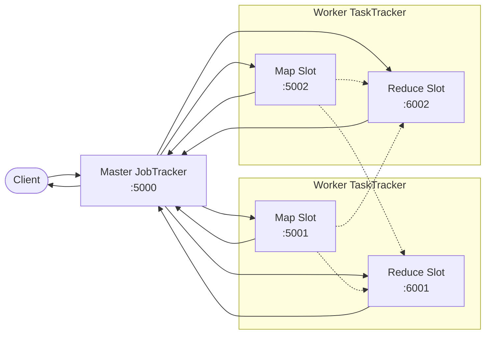

# MapReduce 分布式框架（Python + HTTP）

基于 Python 实现的分布式 MapReduce 框架，Master 和 Worker 以 HTTP 服务形式运行，通过 REST API 协同完成 MapReduce 作业。采用 Hadoop 1.x 风格的分布式 Shuffle + 双 Slot 并行架构。

---

## 技术路线

| 维度 | 方案 |
|------|------|
| **语言** | Python 3.12+ |
| **通信协议** | HTTP + JSON |
| **Web 框架** | Flask |
| **UDF 传输** | pickle 序列化 → base64 编码 |
| **分区策略** | `hashlib.md5(key) % R`（确定性 hash） |
| **并发模型** | 多线程（`threading`）+ Flask 多线程模式 |
| **连接复用** | `requests.Session()` + `threading.local()` 连接池 |

---

## 项目结构

```
python/
├── mapper.py                  # Mapper 抽象基类
├── reducer.py                 # Reducer 抽象基类
├── wordcount_mapper.py        # WordCount 的 map UDF
├── wordcount_reducer.py       # WordCount 的 reduce UDF
├── save.py                    # pickle 序列化工具
│
├── main.py                    # 统一入口（standalone / master / worker / client）
├── run.sh                     # 分布式一键启动脚本
│
└── distributed/               # 分布式框架核心包
    ├── __init__.py
    ├── config.py              # 可配置参数集中管理
    ├── protocol.py            # 协议常量（API 路由、字段名、状态值）
    ├── network.py             # 网络通信（HTTP 连接池、请求封装）
    ├── master.py              # Master 节点（JobTracker）HTTP 服务
    ├── worker.py              # Worker 节点（MapSlot + ReduceSlot）
    └── client.py              # 作业提交客户端
```

### 运行说明

#### 一键运行（推荐）

```bash
cd python
sh run.sh
```

脚本流程：启动 Master → 启动 3 个 Worker → 等待注册 → 提交 WordCount 作业 → 清理进程。

#### 手动分步运行（`main.py` 子命令）

```bash
# 终端 1：启动 Master
python main.py master --port 5000

# 终端 2~4：启动 Worker（端口 5001/5002/5003，每个含双 Slot）
python main.py worker --master localhost:5000 --port 5001
python main.py worker --master localhost:5000 --port 5002
python main.py worker --master localhost:5000 --port 5003

# 终端 5：提交 WordCount 作业
python main.py client --master localhost:5000 --input ../input.txt --output ../output.txt
```

---

## 整体框架



| 角色 | 文件 | 职责 |
|------|------|------|
| **Master** | `distributed/master.py` | Slot 注册管理、作业调度、Map/Reduce 任务分配、10% 提前触发 Reduce、心跳检测与容错重分配、结果汇总输出 |
| **Map Slot** | `distributed/worker.py` (`MapSlot`) | 执行 map 子任务 → 分区（md5 哈希） → Combine 本地归并 → 存储 partition |
| **Reduce Slot** | `distributed/worker.py` (`ReduceSlot`) | 从 Map Slot 拉取 partition 数据 → Shuffle 分组排序 → Reduce → 回传结果 |
| **Client** | `distributed/client.py` | 序列化 UDF → 提交作业 → 轮询状态 → 显示结果 |

---

## HTTP 协议

所有请求/响应使用 `Content-Type: application/json`。

### Master API（默认 :5000）

| 方法 | 路径 | 调用方 | 说明 |
|------|------|--------|------|
| `POST` | `/register` | Worker | 注册 slot（携带 `worker_port` + `slot_type`） |
| `POST` | `/submit_job` | Client | 提交作业（`input_path` + `output_path` + `mapper_pkl` + `reducer_pkl`） |
| `POST` | `/map_done` | Map Slot | 通知 Master map 子任务执行完毕 |
| `POST` | `/reduce_done` | Reduce Slot | 回传 reduce 阶段的结果 |
| `GET` | `/job_status/<job_id>` | Client | 查询作业执行状态 |

### Worker API（Map Slot 端口 P，Reduce Slot 端口 P+1000）

| 方法 | 路径 | Slot 类型 | 调用方 | 说明 |
|------|------|-----------|--------|------|
| `POST` | `/execute_map` | Map | Master | 下发 map 子任务（UDF + 数据分片 + `num_reducers`） |
| `GET` | `/partition/<job>/<pid>` | Map | Reduce Slot | 拉取指定 job 的指定 partition 数据 |
| `POST` | `/execute_reduce` | Reduce | Master | 初始化 reduce（`partition_id` + `total_map_tasks`） |
| `POST` | `/notify_map_ready` | Reduce | Master | 通知一个 map worker 数据已就绪，应去拉取 |
| `GET` | `/ping` | 两者 | Master（心跳） | 健康检查 |

### 数据格式

```
Map 输出：     [[key, value], [key, value], ...]
Combine 后：   [[key, aggregated_value], ...]     （partition 内不重复 key）
Reduce 输入：  [[key, [v1, v2, ...]], ...]        （来自多个 Map Slot 的合并）
Reduce 输出：  [[key, value], [key, value], ...]   （回传 Master，最终写入文件）
```

---

## 执行流程

### 1. Client 提交

```
Client
 └─ save.py 序列化 WordCountMapper/Reducer → .pkl 文件
 └─ base64 编码
 └─ POST /submit_job (input_path + output_path + mapper_pkl + reducer_pkl)
 └─ Master 返回 job_id，后台执行
 └─ Client 轮询 GET /job_status/<job_id> 等待完成
```

### 2. Map 阶段

```
Master
 └─ 读取输入文件 → List[line]
 └─ 均分为 M 份（M = map_slots 数量）
 └─ POST /execute_map 给每个 Map Slot（携带 mapper UDF + reducer UDF + lines + num_reducers）

Map Slot
 └─ 反序列化 mapper UDF
 └─ mapper.map(line) → [(key, value), ...]
 └─ hash(key) % R → partition p
 └─ Combine：对每个 partition 内相同 key 调用 reducer.reduce(key, values) 本地归并
 └─ 存储 partitions[0..R-1]
 └─ POST /map_done → Master

Master
 └─ map_done ≥ 10% 时 → 提前触发 Reduce（dispatch + notify）
```

### 3. Shuffle + Reduce 阶段

```
Master
 └─ POST /execute_reduce 给每个 Reduce Slot（partition_id + total_map_tasks）
 └─ 每当一个 Map Slot 完成 → POST /notify_map_ready 通知所有 Reduce Slot

Reduce Slot
 └─ 收到 /notify_map_ready
     └─ GET /partition/<job>/<pid> 从对应 Map Slot 拉取数据
     └─ 累积 shards
 └─ 集齐 total_map_tasks 个 map worker 后：
     └─ 按 key 分组 → 排序
     └─ reducer.reduce(key, values) → (key, result)
     └─ POST /reduce_done → Master

Master
 └─ 收集所有 reduce_done 结果
 └─ 写入 output.txt（格式：key\tvalue）
 └─ 状态 → completed
```

---

## 项目亮点

### 1. 双 Slot 并行架构
每个 Worker 进程运行两个独立的 Flask 实例：**Map Slot**（端口 P）和 **Reduce Slot**（端口 P+1000）。Map 和 Reduce 可同时运行，充分利用多核资源。

### 2. Reduce 提前触发（10% 阈值）
Map 完成 ≥ 10% 时 Master 即下发 Reduce 任务。Reduce Slot 开始增量拉取已完成 Map Slot 的 partition 数据，Map 与 Reduce 流水线并行，缩短总执行时间。

### 3. Combine 机制（Map 端本地归并）
Map Slot 在分区后、存储前对每个 partition 内相同 key 调用 `reducer.reduce` 做本地归并。以 WordCount 为例，`[a,1][a,1][a,1]` → `[a,3]`，大幅减少网络传输数据量和 Shuffle 压力。

### 4. HTTP 连接池
使用 `requests.Session()` + `threading.local()` 实现线程安全的 TCP 连接复用，避免每次 HTTP 调用重复建立连接的开销。

### 5. 心跳检测 + 容错重分配
Master 后台线程每 5 秒 ping 所有 Slot。超时 15 秒未响应 → 标记为 dead → 自动重新分配任务：
- **Map Slot 崩溃**：将 pending chunks 重新分配给存活 slot
- **Reduce Slot 崩溃**：重新 dispatch + notify 存活 Reduce Slot

### 6. 分布式 Shuffle（类似 Hadoop 1.x）
Map 端 `hash(key) % R` 分区后本地存储，Reduce 端通过 HTTP 拉取对应 partition。数据不经过 Master，避免 Master 成为瓶颈。

### 7. 配置集中管理
`distributed/config.py` 统一管理所有可调参数（心跳间隔、超时阈值、端口偏移等），修改无需改动业务代码。
